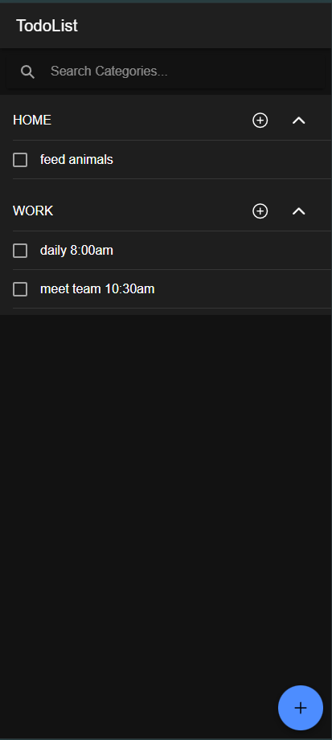
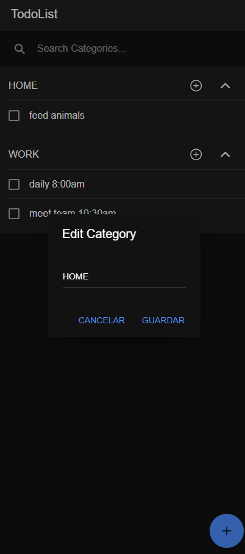
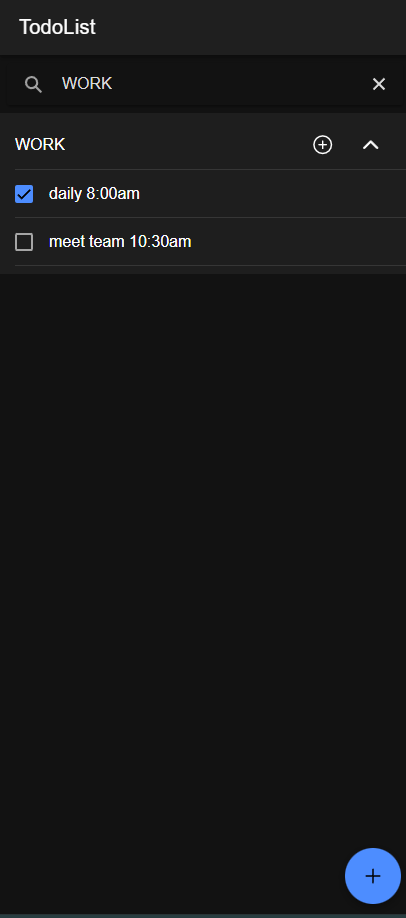
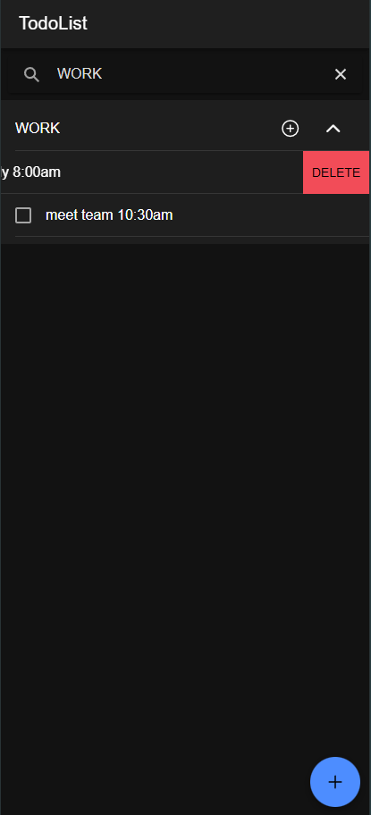

# 📝 TodoList App

Aplicación desarrollada con **Ionic + Angular**, diseñada para gestionar listas de tareas y categorías. Esta app permite agregar, editar, completar o eliminar tareas, todo almacenado localmente con soporte para configuración remota de funcionalidades (feature flags) usando Firebase.

## 🚀 Demo

👉 [Ver demo en Google Drive](https://drive.google.com/drive/folders/1ZhyRhJ5yiiPPh5tr0_bv8OSriGDksIQp?usp=drive_link)

## 📸 Captura de pantalla

### Vista 1

### Vista 2

### Vista 3

### Vista 4

## ⚙️ Tecnologías utilizadas

- Ionic Framework
- Angular (standalone components)
- Firebase Remote Config
- RxJS
- Android Studio
- Xcode
- LocalStorage
- Cordova

## 📚 Funcionalidades

- ✅ Crear tareas por categoría
- 📝 Editar nombres de categorías
- 📦 Almacenamiento local de tareas
- 🔁 Marcar tareas como completas
- 🧹 Eliminar tareas y categorías
- 🔄 Feature Flags (activar o desactivar funcionalidades dinámicamente desde Firebase)
- 🚀 Optimización de rendimiento (carga eficiente de datos, suscripciones limpias, trackBy)

## 🛠️ Instalación y ejecución local

\`\`\`bash
# Clona el repositorio
git clone https://github.com/imartinezaguas/todolist-app.git
cd todolist-app

# Instala dependencias
npm install

# Levanta la aplicación en navegador
ionic serve
\`\`\`

## 📲 Generar build con Cordova

### 👉 Android (modo release)

\`\`\`bash
# Paso 1: Compilar el proyecto con Ionic
ionic cordova build android --release

# Paso 2: Compilar con Cordova directamente (opcional en algunos casos)
cordova build android --release
\`\`\`

> Abrir Android studio el build del proyecto, genera el apk ve a build -> Build app Bundle 

### 🍎 iOS (solo en macOS)

\`\`\`bash
ionic cordova platform add ios
ionic cordova build ios
\`\`\`

> Luego abre `platforms/ios` en Xcode para emular o generar `.IPA`.

## 🔥 Configuración de Firebase

1. Ve a [Firebase Console](https://console.firebase.google.com/)
2. Crea un proyecto y configura Remote Config
3. Agrega las claves en tu `environment.prod.ts`:

\`\`\`ts
export const environment = {
  production: true,
  firebaseConfig: {
    apiKey: 'TU_API_KEY',
    authDomain: 'TU_DOMINIO',
    projectId: 'TU_ID',
    storageBucket: '',
    messagingSenderId: '',
    appId: ''
  }
};
\`\`\`

## 🎥 Demostración de cómo el feature flag afecta la funcionalidad de la aplicación

👉 [Haz clic aquí para ver el video](https://youtu.be/yfvSrDuhPsU)

## 📄 Licencia

Este proyecto está bajo la licencia MIT.
